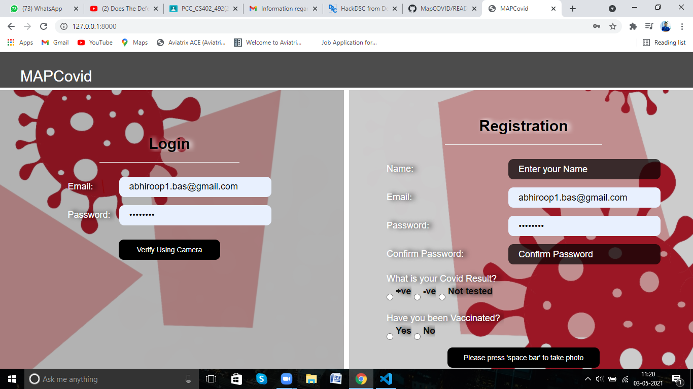
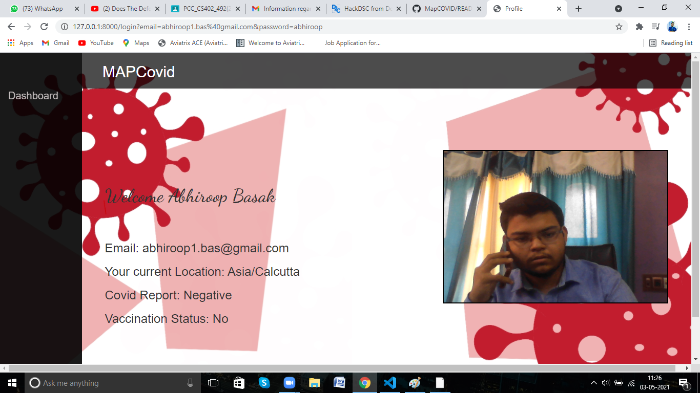
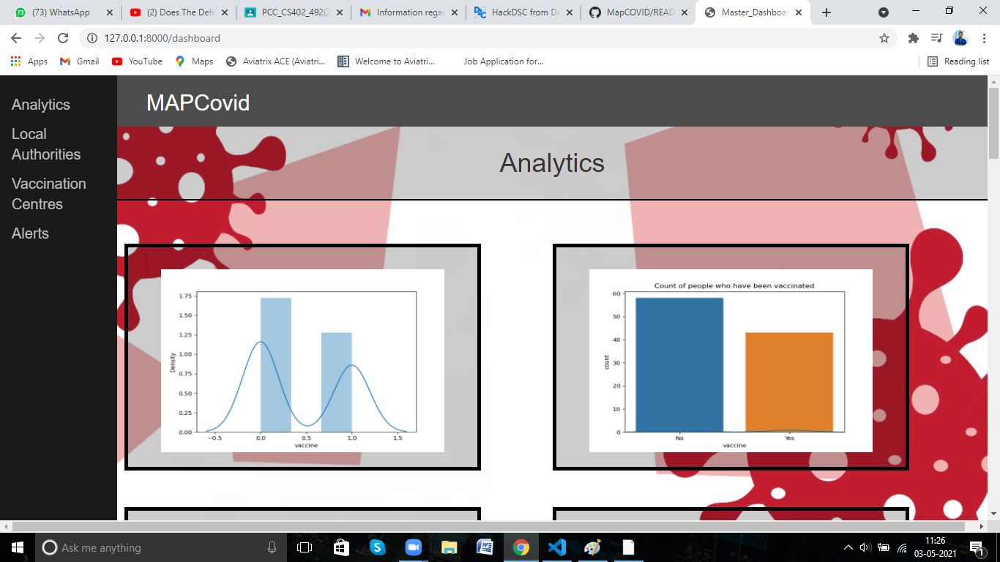
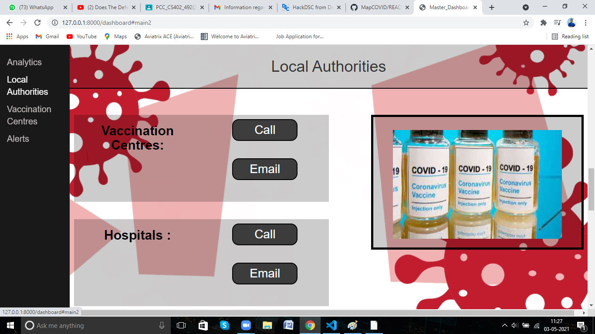
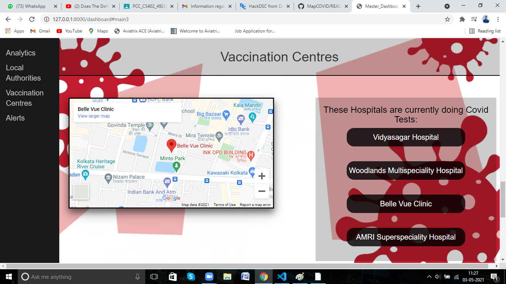
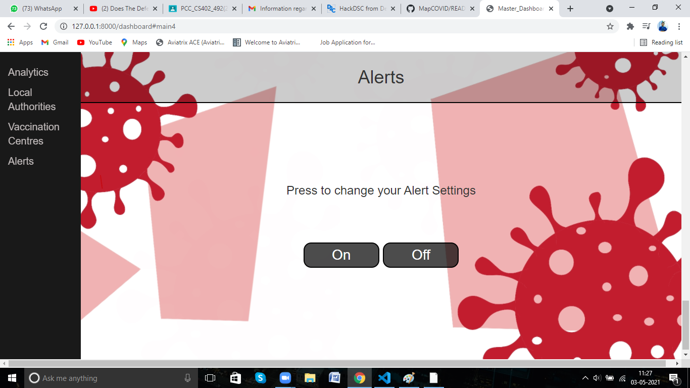
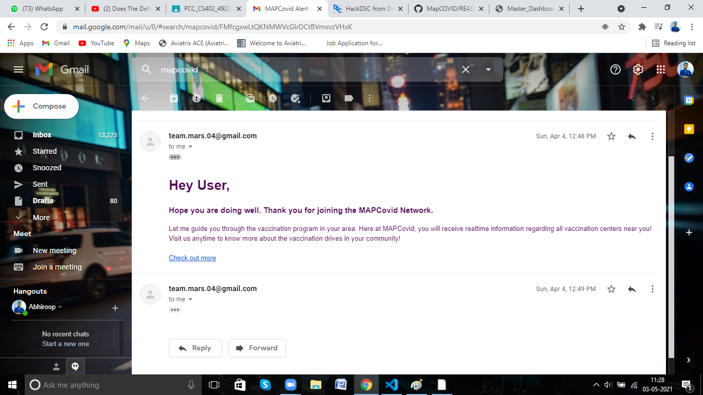

# MapCOVID

## Introduction

MapCovid is a unique solution to the Covid 19 pandemic that we are facing currently. Team MARS aims at creating a personalized Covid 19 tracking mechanism that shall benefit everyone. Secure login has been established for every user and they can fill up a questionnaire that stores data regarding whether they have contacted Covid and/or been vaccinated. It also shows the statistics of the people infected and vaccinated in an area.

## Through the application

Home page

As the user enters into the console, a thorough verification using camera is made to ensure privacy of data on the platform

As the location has already been detected, the user is now shown data based on regional and local areas the repective statistics and emergency details of the local authoritites and vaccination centers are sent out.

   

The above mentioned alert works on the users mail to send automatic messages to the user about activity on the account also on recent additions of vaccines or local emergency help lines in the area. It also rallies hospital information in view of the recent pandemic.

